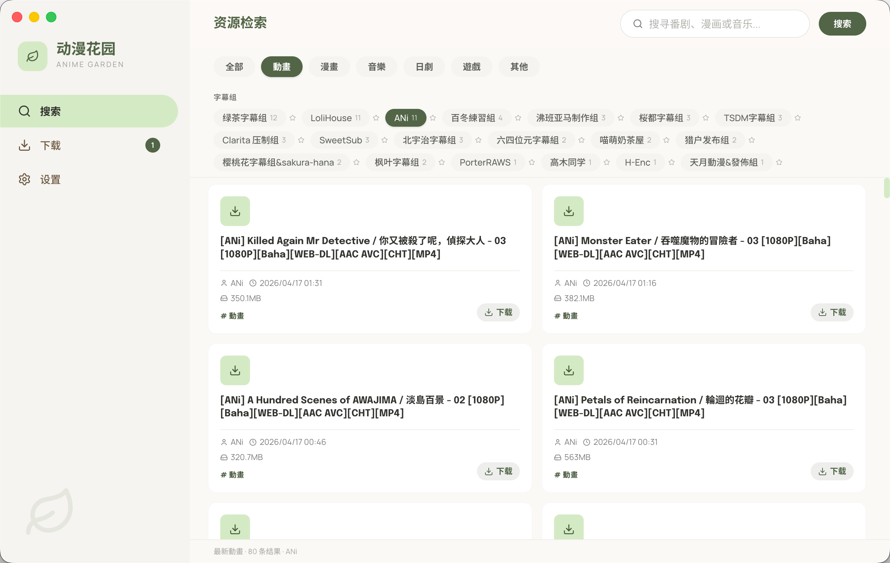
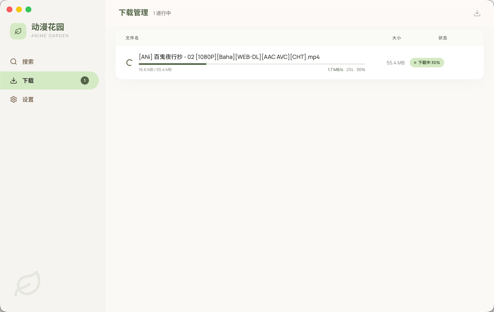
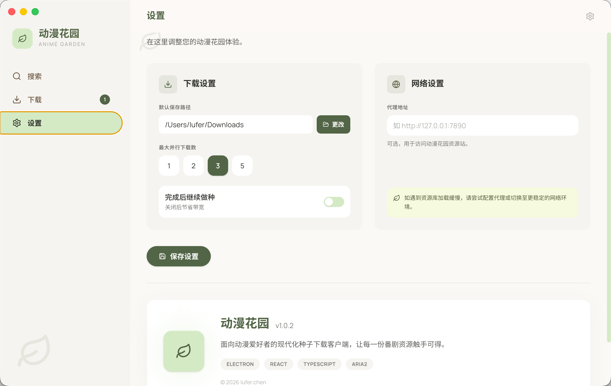

# dmhy Desktop

<p align="center">
  
  
  
  
</p>

A desktop client for [dmhy.org](https://dmhy.org) — search and download anime torrents with a clean, modern UI, powered by the aria2 download engine.

> 中文文档请见 [README_CN.md](./README_CN.md)

---

## Screenshots





---

## Features

### Core

- **Search** — Search anime resources by keyword with category filters (Anime, J-Drama, RAW, etc.) and publisher group filtering
- **One-click download** — Prefers `.torrent` files for fast metadata resolution, falls back to Magnet links automatically
- **Download management** — Real-time progress, speed, and ETA display; pause / resume / remove tasks (with optional local file deletion)
- **Seeding control** — Choose to keep seeding after completion or stop immediately to save bandwidth
- **Proxy support** — A single HTTP proxy setting covers both web scraping and all BitTorrent traffic via aria2
- **Session restore** — Unfinished downloads are automatically resumed on next launch
- **Cross-platform** — Windows and macOS

### Recent updates

- **v1.0.4** — macOS 26 (Tahoe) compatibility: Electron upgraded to 39.8.8, ad-hoc re-signing applied to all bundle binaries; download list column alignment fixed; window drag region extended to content-area headers; redundant download percentage removed
- **v1.0.3** — Empty keyword search support; back-to-top button (appears after scrolling 300 px); simplified publisher group filter; wider scrollbars
- **v1.0.2** — Full UI redesign: "Botanical Atelier" design system (sage green + warm paper white), two-column card grid, redesigned sidebar with text labels, Bento-grid settings layout
- **v1.0.1** — Download directory picker modal (with 7-day suppression); download duration tracking; dev-server port conflict detection

---

## Download

Head to the [Releases](../../releases) page and grab the installer for your platform:

| Platform | File | Notes |
|----------|------|-------|
| Windows | `dmhy-desktop-*-setup.exe` | NSIS installer (recommended) |
| Windows | `dmhy-desktop-*-portable.exe` | No-install portable executable |
| macOS (Intel) | `dmhy-desktop-*-x64.dmg` | x64 |
| macOS (Apple Silicon) | `dmhy-desktop-*-arm64.dmg` | arm64 |

> **macOS Gatekeeper warning ("unverified developer")**: Open **System Settings → Privacy & Security** and click **Open Anyway**.

---

## Tech Stack

| Layer | Technology |
|-------|------------|
| Framework | Electron 39.8.8 |
| Frontend | React 19.2.1 · TypeScript 5.9.3 · Tailwind CSS v4.2.2 |
| State | Zustand 5 |
| Download engine | aria2 v1.37.0 (JSON-RPC, bundled binary) |
| Web scraping | axios · cheerio |
| Persistence | electron-store · custom task cache |

---

## Development

### Prerequisites

- Node.js 18+
- npm
- `aria2c` in PATH (used in dev mode; production builds bundle their own binary)

```bash
# macOS
brew install aria2
```

### Start the dev server

```bash
npm install
npm run dev
```

### Available scripts

| Script | Description |
|--------|-------------|
| `npm run dev` | Start with hot-reload |
| `npm run build:mac` | Build macOS DMG (Intel + Apple Silicon) |
| `npm run build:win` | Build Windows NSIS installer + portable |
| `npm run typecheck` | TypeScript type check |
| `npm run lint` | ESLint |
| `npm run format` | Prettier |

---

## Project Structure

```
src/
├── main/                 # Electron main process
│   ├── index.ts          # App entry, window creation, lifecycle
│   ├── downloader.ts     # aria2 wrapper, task management
│   ├── ipc-handlers.ts   # IPC bridge between main and renderer
│   ├── scraper.ts        # dmhy.org web scraper
│   ├── store.ts          # Settings persistence (electron-store)
│   └── task-cache.ts     # Download task cache (task ↔ GID mapping)
├── preload/              # Renderer bridge
│   ├── index.ts          # contextBridge API exposure
│   └── index.d.ts        # Global type declarations
└── renderer/src/         # React frontend
    ├── App.tsx           # Root layout, sidebar nav, window controls
    ├── pages/            # Search, Downloads, Settings
    ├── components/       # ResourceCard, DownloadItem, PublisherFilter
    ├── store/            # Zustand stores
    ├── types/            # Shared TypeScript interfaces
    └── assets/           # Global styles
```

---

## Bundled aria2 Binaries

Production builds ship with pre-compiled aria2 executables:

| Platform | Path | Source |
|----------|------|--------|
| Windows | `resources/aria2c.exe` | aria2 official release v1.37.0 |
| macOS | `resources/aria2c` | Copied from Homebrew at build time |

Before building for macOS, ensure `resources/aria2c` is in place:

```bash
bash scripts/setup-aria2-mac.sh
```

---

## User Data

All app data is stored in the OS user data directory (`app.getPath('userData')`). No account credentials are stored.

| File | Contents |
|------|----------|
| `settings.json` | Download path, concurrency, proxy URL, seeding toggle |
| `tasks.json` | Task cache for session restore |
| `aria2.session` | aria2 session file for resumable downloads |

---

## Changelog

| Version | Highlights |
|---------|------------|
| **v1.0.4** | macOS 26 compatibility fix · download list column alignment · window drag region expanded · UI polish |
| **v1.0.3** | Empty keyword search · back-to-top button · simplified publisher filter · wider scrollbars |
| **v1.0.2** | "Botanical Atelier" UI redesign · two-column card grid · Bento settings · new sidebar |
| **v1.0.1** | Download directory picker · duration tracking · port-conflict detection |
| **v1.0.0** | Initial release — search, download, seeding control, proxy, session restore |

Full release notes on the [Releases](../../releases) page.

---

## License

MIT © 2026 lufer.chen
